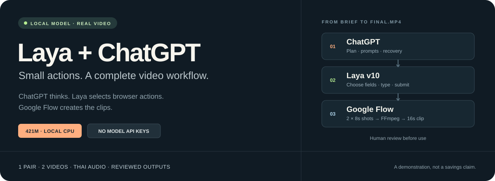

<p align="center">
  
</p>

<h1 align="center">Laya + ChatGPT → Google Flow</h1>

<p align="center">
  <strong>ให้ ChatGPT คิด ให้โมเดลเล็กในเครื่องช่วยลงมือ แล้วดูผลจากคลิปจริง</strong><br>
  เวิร์กโฟลว์ภาษาไทยสำหรับทำคลิปสินค้า 16 วินาที ผ่าน ChatGPT Desktop · Work locally
</p>

<p align="center">
  <a href="LICENSE"></a>
  <a href="https://huggingface.co/cklxx/laya-browser"></a>
  <a href="#results"></a>
  <a href="#quickstart"></a>
</p>

<p align="center">
  <a href="#demo">ดูวิดีโอ</a> · <a href="#results">Token และเวลา</a> · <a href="#quickstart">เริ่มใช้งาน</a> · <a href="docs/WORKFLOW.md">คู่มือคำสั่ง</a> · <a href="docs/BENCHMARK.md">วิธีวัดผล</a>
</p>

ให้ **ChatGPT Desktop → Work locally เป็นตัวคิด** และให้ **Laya v10 ขนาด 421M จาก Hugging Face ทำงานในเครื่อง** เพื่อเลือกช่องและปุ่มบน Google Flow แล้วดาวน์โหลดสองช็อตมาต่อด้วย FFmpeg เป็นคลิปพร้อมตรวจ ไม่ต้องใช้ API key ของโมเดล และไม่มีการโพสต์คลิปอัตโนมัติ

> **จบการสาธิตที่ 1 คู่แล้ว** — ผู้ใช้ตรวจภาพและเสียงผ่านทั้งสองคลิป และเลือกใช้ผลชุดนี้ ไม่มีการติดตามโควตาหรือสร้างรอบเพิ่ม ตัวเลขด้านล่างเป็นผลที่สังเกตได้จากสองรอบนี้เท่านั้น

<a id="demo"></a>
## ดูผลงานสองวิธี

โจทย์เดียวกัน: **แก้วเซรามิกสมมติสีครีม บรรยากาศมุมพักริมหน้าต่าง** ใช้ [prompt เดียวกันสองช็อต](examples/benchmark-prompts.json), `6 Astra / xhigh` และ Flow `Veo 3.1 Lite · 720p · 9:16 · x1 · Agent off` ทั้งคู่

<table>
  <thead>
    <tr>
      <th width="50%">01 · ChatGPT</th>
      <th width="50%">02 · Laya + ChatGPT</th>
    </tr>
  </thead>
  <tbody>
    <tr>
      <td align="center"><video src="https://github.com/user-attachments/assets/84b0a064-14fc-4dab-b465-432220a6d841" controls width="320"></video></td>
      <td align="center"><video src="https://github.com/user-attachments/assets/3ddb7ce9-8d24-45c2-b5a0-62def2f533c6" controls width="320"></video></td>
    </tr>
    <tr>
      <td align="center"><strong>10 นาที 17 วินาที</strong><br>26,197 visible tokens โดยประมาณ<br>16s · เสียงไทย · QC ผ่าน</td>
      <td align="center"><strong>8 นาที 5 วินาที</strong><br>16,322 visible tokens โดยประมาณ<br>16s · เสียงไทย · QC ผ่าน</td>
    </tr>
    <tr>
      <td align="center"><a href="https://github.com/user-attachments/assets/84b0a064-14fc-4dab-b465-432220a6d841">เปิดวิดีโอ ChatGPT</a> · <a href="results/baseline-1.json">ดูข้อมูลรอบนี้</a></td>
      <td align="center"><a href="https://github.com/user-attachments/assets/3ddb7ce9-8d24-45c2-b5a0-62def2f533c6">เปิดวิดีโอ Laya + ChatGPT</a> · <a href="results/hybrid-1.json">ดูข้อมูลรอบนี้</a></td>
    </tr>
  </tbody>
</table>

กดเล่นและเปิดเสียงทีละคลิปเพื่อฟังบทพูดไทย GitHub อาจเริ่มต้นด้วยการปิดเสียง ไฟล์ทั้งสองเป็นต้นฉบับที่ผู้ใช้ตรวจรับแล้ว ไม่มีการเร่งภาพหรือตัดช่วงออกเพื่อการแสดงผล

**บทพูดเดียวกัน:** “มุมพักเล็ก ๆ กับแก้วใบโปรด” → “ชอบสไตล์นี้ ดูรายละเอียดสินค้าก่อนตัดสินใจได้เลย”

<a id="results"></a>
## Token และเวลาที่วัดได้

**1 รอบต่อวิธี · 23 กันยายน 2026 · Mac Apple Silicon / RAM 16 GB / CPU**

| มาตรวัด | ChatGPT | Laya + ChatGPT |
|:---|---:|---:|
| **เวลาทำงาน รวมโหลดโมเดลและรอ Flow** | **616.768s** | **484.675s** |
| ข้อความขาเข้า — token โดยประมาณ | 16,872 | 8,379 |
| ข้อความขาออก — token โดยประมาณ | 9,325 | 7,943 |
| **ข้อความรวม — token โดยประมาณ** | **26,197** | **16,322** |
| เครดิต Flow | 20 | 20 |
| ความยาวคลิป / ขนาด | 16s / 720×1280 | 16s / 720×1280 |
| ตรวจภาพและเสียงโดยผู้ใช้ | ผ่าน | ผ่าน |

**Token ในตารางคืออะไร?** นับข้อความที่เก็บได้ครั้งเดียวด้วย `o200k_base` รวมคำสั่งเครื่องมือและผลตอบกลับ ไม่รวมภาพ คำสั่งที่ซ่อนอยู่ reasoning หรือการส่งบริบทซ้ำ จึง **ไม่ใช่ยอด token เรียกเก็บจริง** และไม่ใช่ยอดเงินที่ประหยัด เวลาเริ่มที่ `init` และจบที่ `finish` เดิม; เวลารอผู้ใช้ตรวจคลิปภายหลังแสดงแยกในรายงาน

> **อ่านผลอย่างไร:** รอบ hybrid นี้ใช้เวลาและข้อความที่สังเกตได้น้อยกว่า แต่ยังระบุไม่ได้ว่าเกิดจาก Laya เท่าใด มีเพียงหนึ่งคู่, transcript ยังไม่ยืนยันว่าครบ, baseline มีบริบทเตรียมงานติดมา และสองวิธีใช้ช่องทางนำทางหน้าเว็บต่างกันบางส่วน จึงไม่สรุปเปอร์เซ็นต์ประหยัดหรือผลทั่วไป

<details>
<summary><strong>เจาะส่วนของ Laya และเวลาระหว่างทาง</strong></summary>

| รายการ | ChatGPT | Laya + ChatGPT |
|:---|---:|---:|
| Laya decisions | 0 | 4 |
| Laya input tokens — tokenizer ของ Laya | — | 4,928 |
| โหลด Laya ภายในรอบ | — | 50.124s / 2 ครั้ง |
| Laya inference รวม | — | 4.562s |
| รอ Flow | 64.427s | 84.687s |
| ดาวน์โหลด | 0.309s | 1.054s |
| รวมคลิป | 2.538s | 1.794s |
| Action errors / ส่งกลับให้ ChatGPT แก้ | 0 / 0 | 0 / 0 |

Laya เลือกกรอกและกดส่ง prompt ผ่าน 2 delegations รวม 4 actions ส่วน ChatGPT ยังจัดการตั้งค่า นำทาง และเปิดเมนูดาวน์โหลด จึงไม่ใช่การให้ Laya ทำทุกการกดเอง ตัวเลขเวลาแต่ละส่วนเป็นรายการที่จับได้ ไม่ได้ครอบคลุมทุกวินาทีของรอบ

</details>

<details>
<summary><strong>Host telemetry — token ที่ local runtime บันทึกไว้</strong></summary>

| รายการ | ChatGPT | Laya + ChatGPT |
|:---|---:|---:|
| จำนวน response records | 35 | 30 |
| Input รวมการส่งบริบทซ้ำ | 4,884,089 | 2,590,355 |
| Cached input — อยู่ใน Input แล้ว | 4,844,544 | 2,564,736 |
| Uncached input | 39,545 | 25,619 |
| Output | 13,866 | 11,148 |
| Reasoning output — อยู่ใน Output แล้ว | 4,193 | 2,269 |
| **Input + Output** | **4,897,955** | **2,601,503** |

เป็นคนละมาตรวัดกับ visible-text estimate ด้านบน: host นับบริบทที่ส่งซ้ำต่อ response ตัวอ่านตัด response ID ซ้ำแล้ว แต่ยังไม่ได้ยืนยันกับบิลหรือ usage API ห้ามบวก cached/reasoning ซ้ำหรือใช้คำนวณค่าใช้จ่าย เราเผยแพร่เฉพาะตัวเลข ไม่เผยแพร่เนื้อหา reasoning หรือบทสนทนาดิบ

</details>

[ผลและข้อจำกัดฉบับเต็ม](results/README.md) · [ข้อมูลรวม JSON](results/pair-1.json) · [วิธีจับเวลาและนับ token](docs/BENCHMARK.md) · [ที่มาและ hash ของวิดีโอ](assets/media.json)

## แต่ละส่วนทำอะไร

| ส่วน | หน้าที่ |
|:---|:---|
| **ChatGPT · Work locally** | เข้าใจโจทย์ เตรียม prompt ส่งงานให้ตัวรัน และแก้เมื่อ Laya ทำต่อไม่ได้ |
| **Laya v10 · 421M** | เลือก operation และ target จากหน้าเว็บ ประมวลผลบน CPU ในเครื่อง |
| **Chrome + Google Flow** | สร้างวิดีโอผ่านหน้าเว็บปกติ ใช้บัญชีและเครดิต Flow ของผู้ใช้ |
| **FFmpeg + ผู้ตรวจ** | ต่อสองช็อตเป็น 16 วินาที แล้วดูภาพ ฟังเสียง และตัดสินก่อนนำไปใช้ |

Laya เป็นโมเดลเลือกการกระทำ จึงต้องให้ ChatGPT เตรียมข้อความที่จะกรอกไว้ เมื่อทำต่อไม่ได้จะส่ง `needs_reasoning` กลับมา Repo นี้ใช้ ChatGPT Work เป็นตัวคิด ส่วนรอบพัฒนาที่ทำใน Codex แยกเป็น pilot และไม่นับปนในตาราง

<a id="quickstart"></a>
## เริ่มใช้บน Mac

ต้องมี **ChatGPT Desktop ที่ใช้ Work locally และคำสั่งในเครื่องได้**, Chrome, บัญชี Flow/เครดิต, [uv](https://docs.astral.sh/uv/getting-started/installation/) และ FFmpeg ทดสอบด้วย CPU บน Apple Silicon / RAM 16 GB

**1. เตรียมตัวรัน**

```bash
git clone https://github.com/Boom-Vitt/laya-chatgpt-flow.git
cd laya-chatgpt-flow
uv sync --locked
uv run python flow.py doctor
sh scripts/open-chrome-mac.sh
```

**2. ล็อกอิน Flow** ใน Chrome หน้าต่างทดสอบ แล้วเปิดโปรเจกต์ที่จะใช้ โปรไฟล์นี้แยกจาก Chrome ประจำวัน

**3. เปิด repo ใน ChatGPT Desktop → Work locally** แล้วส่งข้อความนี้:

```text
อ่าน .agents/skills/laya-chatgpt-flow/SKILL.md แล้วใช้ Laya + ChatGPT
ทำคลิปสินค้าตัวอย่างจาก examples/product.md ความยาว 16 วินาที
ตรวจรุ่นและราคา Flow ปัจจุบันก่อนสร้าง ใช้เครดิตไม่เกิน 20
ถ้าเครดิตไม่พอให้หยุด ไม่ซื้อเพิ่ม ไม่โพสต์คลิป
รายงานเวลา เครดิต และทุกครั้งที่ ChatGPT ต้องรับช่วงจาก Laya
```

**4. ตรวจคลิปก่อนใช้** ดูสัดส่วนสินค้า มือ ความต่อเนื่อง และฟังบทพูดไทยให้ครบ ไฟล์จะอยู่ใน `runs/<ชื่อรอบ>/final.mp4`

[คู่มือคำสั่งทีละขั้น](docs/WORKFLOW.md) · [Skill ที่ใช้](.agents/skills/laya-chatgpt-flow/SKILL.md) · [brief ตัวอย่าง](examples/product.md)

## ฟรีส่วนไหน และมีข้อจำกัดอะไร

- **Laya ดาวน์โหลดและรันในเครื่องฟรี** ไม่ใช้ hosted inference หรือ OpenAI API; ChatGPT ใช้สิทธิ์บัญชีของคุณ และ Flow ใช้เครดิตของ Google จึงไม่ใช่ระบบสร้างวิดีโอฟรีทั้งหมด
- ชุดสาธิตนี้ใช้ **40 เครดิตสำหรับสองคลิป + pilot 10 = 50 เครดิต** ไม่มีการซื้อเพิ่ม ราคาที่ตรวจเมื่อ 23 ก.ย. 2026 คือ 10 เครดิตต่อช็อต ต้องตรวจ UI ใหม่ก่อนใช้งานจริง [รายละเอียดเครดิต Flow](https://support.google.com/flow/answer/16526234?hl=en)
- เป็น **text-to-video ของสินค้าสมมติ** ยังไม่มีขั้นตอนอัปโหลดภาพสินค้าจริง และไม่รับประกันความคงที่ของสินค้าในทุกช็อต
- ไม่มีการซื้อเครดิต โพสต์คลิป หรือปักตะกร้าอัตโนมัติ คุณตรวจรายละเอียดสินค้าและนำคลิปไปใช้เอง
- UI ของ Flow เปลี่ยนได้ และ Laya อาจเลือกผิด หาก control ไม่ตรงหรือทำต่อไม่ได้ ตัวรันจะหยุดพร้อมเหตุผล
- Chrome debugger ใช้เฉพาะ `127.0.0.1:9223` เก็บ profile, cookies, transcript และ raw logs ไว้ใน `runs/` ที่ Git ไม่ติดตาม **เผยแพร่เฉพาะวิดีโอสองไฟล์ที่ผู้ใช้อนุญาตและผลรวมที่ตรวจแล้ว**

<details>
<summary><strong>สำหรับผู้พัฒนา: ตรวจตัวรันโดยไม่ใช้เครดิต</strong></summary>

```bash
uv run python -m unittest discover -s tests -v
RUN_BROWSER_CHECKS=1 RUN_MEDIA_CHECKS=1 uv run python -m unittest discover -s tests -v
uv run ruff check .
uv run python flow.py model-check
```

Browser check ใช้ Chrome ใหม่กับ HTML ในเครื่อง ส่วน media check ใช้สัญญาณภาพ/เสียงทดสอบ ไม่สร้างงานบน Flow จริง `model-check` โหลด Laya และรายงานการเลือกผิดตามจริง ดู [ผลทดสอบรวมถึงกรณีที่ไม่ผ่าน](results/README.md)

</details>

## ที่มา

แนวคิดเวิร์กโฟลว์มาจาก [ChatGPT × Google Flow ทำหนังสั้นจีนแนวตั้ง — BoomBigNose](https://youtu.be/7ZbYX93n4GY) ส่วนการจัดหน้าใช้แนวทางภาพสาธิตเด่นและ quick start ที่อ่านง่ายจาก [Browser Use](https://github.com/browser-use/browser-use), [Claude Code](https://github.com/anthropics/claude-code) และ [MarkItDown](https://github.com/microsoft/markitdown) ออกแบบแบนเนอร์ใหม่สำหรับ repo นี้

โค้ด **MIT** · Laya/โมเดล **Apache-2.0** · โปรเจกต์ทดลองอิสระ ไม่ใช่ผลิตภัณฑ์ของ OpenAI หรือ Google — [แหล่งที่มาและสิทธิ์ทั้งหมด](THIRD_PARTY_NOTICES.md)
